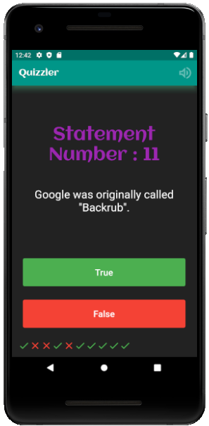
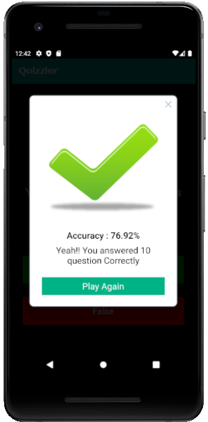
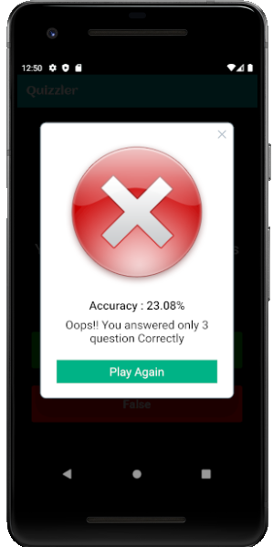

# 🍔QuizCons [](http://makeapullrequest.com) <a href="https://github.com/Solido/awesome-flutter"></a>

A trial for singleScreen quiz app in flutter. 

## 📸 ScreenShots

|

## ✨ Requirements
* Any Operating System (ie. MacOS X, Linux, Windows)
* Any IDE with Flutter SDK installed (ie. IntelliJ, Android Studio, VSCode etc)
* A little knowledge of Dart and Flutter


## Getting Started

This project is a starting point for a Flutter application.

A few resources to get you started if this is your first Flutter project:

- [Lab: Write your first Flutter app](https://flutter.dev/docs/get-started/codelab)
- [Cookbook: Useful Flutter samples](https://flutter.dev/docs/cookbook)

For help getting started with Flutter, view our
[online documentation](https://flutter.dev/docs), which offers tutorials,
samples, guidance on mobile development, and a full API reference.

## Run the Project:
  
  - Install Flutter SDK
  - Clone the project
  - Run the following commands
  
    ```
    flutter pub get
    flutter run
    ```
    
    
